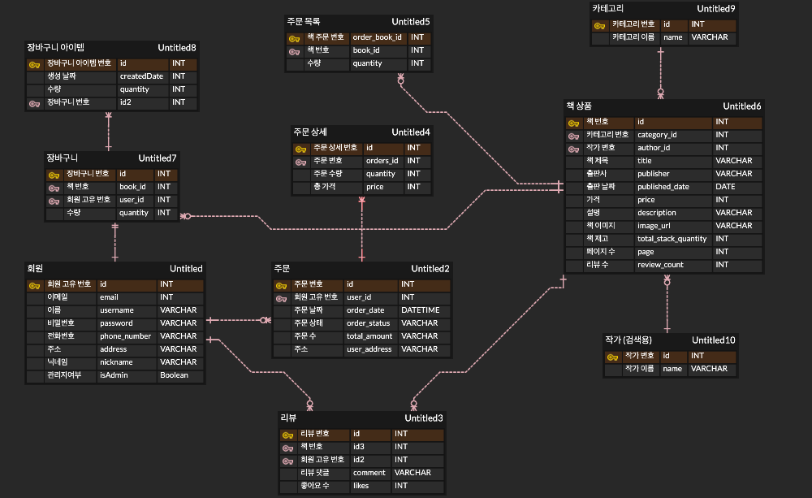
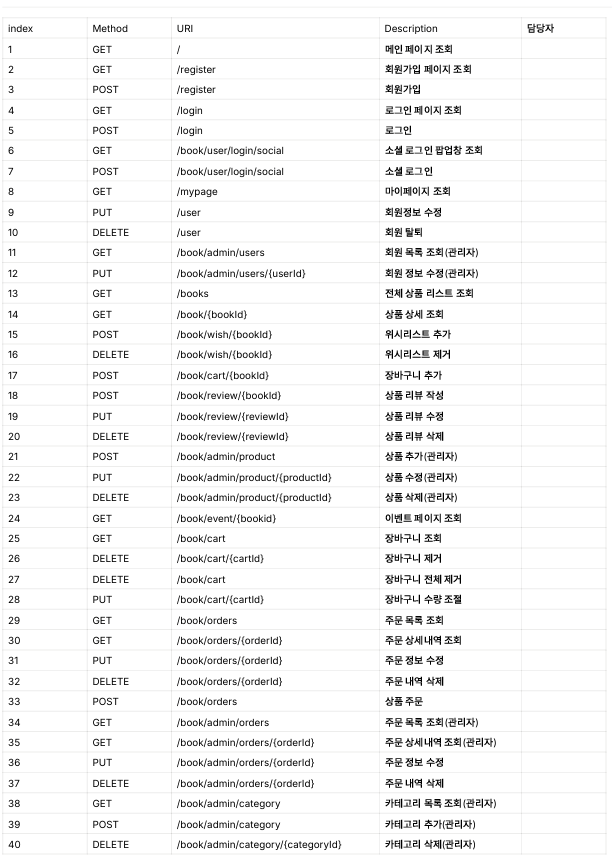
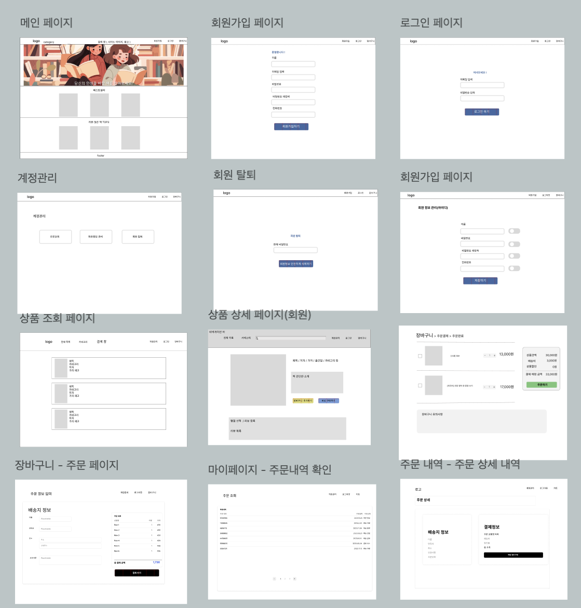
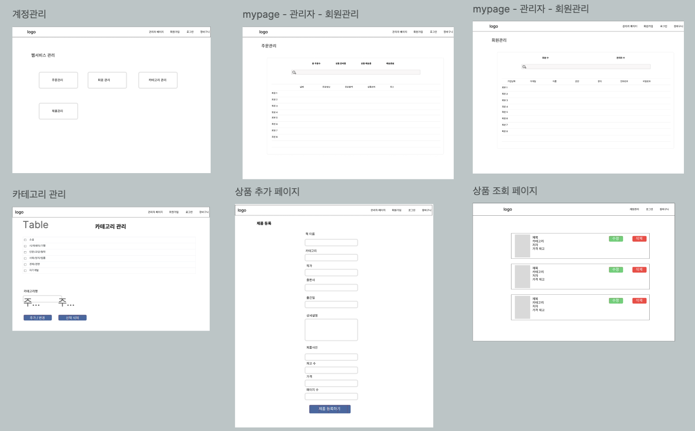

# 북팔이 📚
**다양한 장르의 도서를 온라인에서 편리하게 구매 및 대여할 수 있는 플랫폼입니다.**

### ⏱️ 개발 기간
**2024-5-27(월) ~ 2024-6-21(금)**

 

## 💡 ERD

## 💡 API 명세서

## 💡 와이어프레임

=> 로그아웃 상태(즉, guest 상태)와 일반 user가 접근 가능한 페이지입니다.

=> 관리자 user로 로그인했을때만 접근 가능한 페이지이며 관리자는 회원관리, 상품관리, 회원들의 주문관리, 도서의 카테고리 관리가 가능합니다.

## 💡 시연 사진

